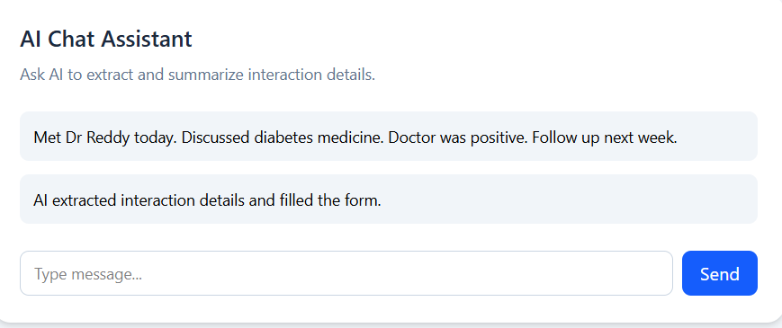
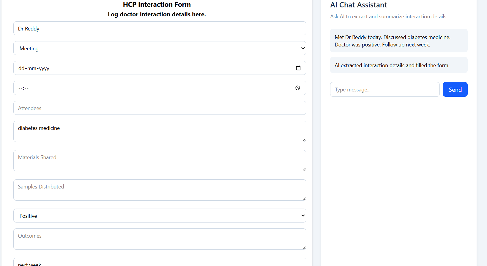
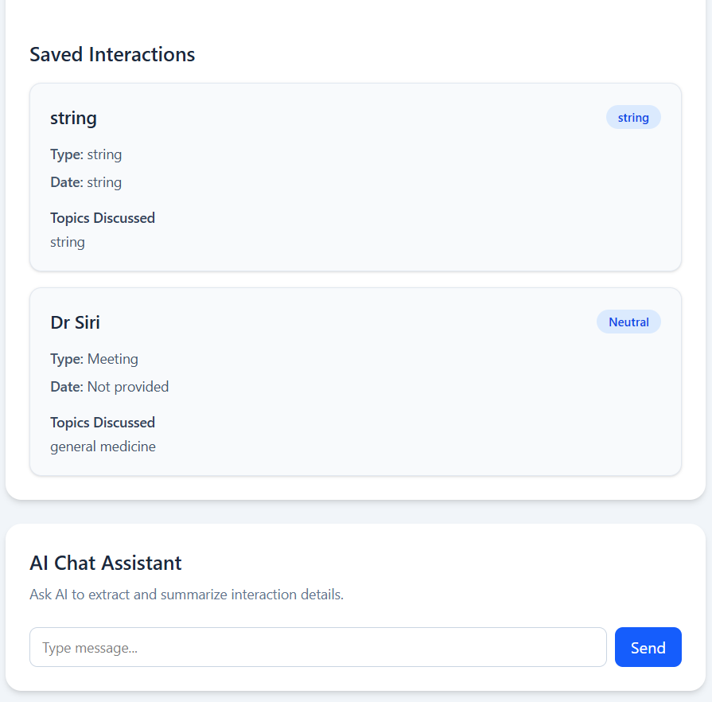
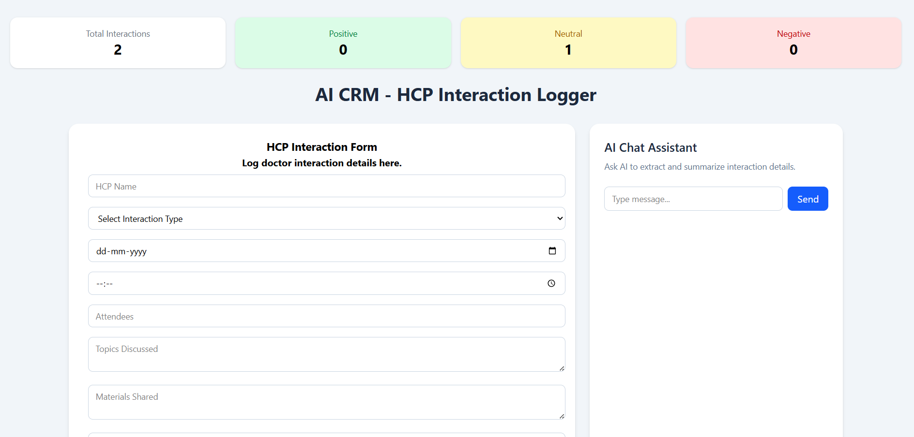
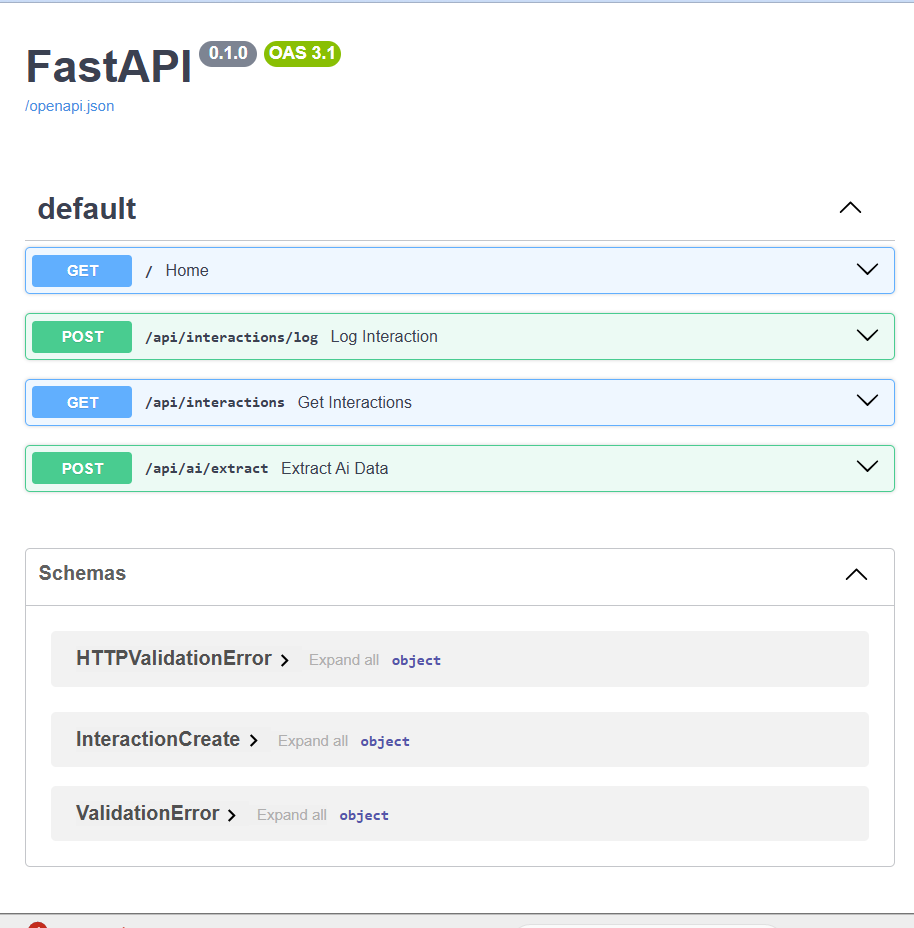
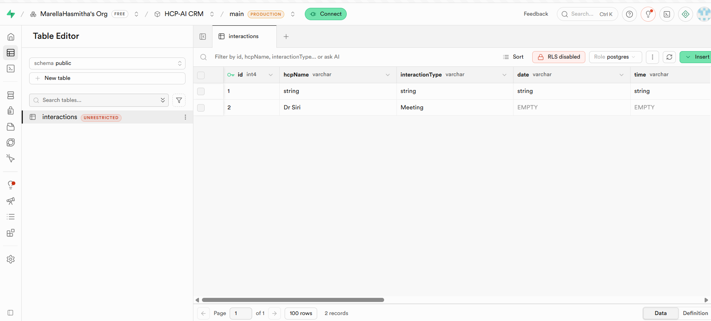

# AI CRM HCP Interaction System

## Overview

AI CRM HCP Interaction System is an AI-powered healthcare CRM application built to manage and analyze HCP (Healthcare Professional) interactions.

The system allows users to:

* Log HCP interactions manually
* Use AI-powered chat input to automatically extract interaction details
* Store interactions permanently in PostgreSQL
* Analyze interaction sentiment
* Generate follow-up actions
* Display dashboard analytics
* Use LangGraph workflows for AI processing pipelines

The project demonstrates a modern enterprise AI application architecture using React, FastAPI, PostgreSQL, LangGraph, and Groq LLM APIs.

---

# Features

## Frontend Features

* React + Vite frontend
* Tailwind CSS responsive UI
* Redux global state management
* AI chat panel
* Interaction form auto-fill
* Dashboard analytics cards
* Form validation
* Error handling
* Loading states
* Persistent interaction display after refresh

---

## Backend Features

* FastAPI backend APIs
* PostgreSQL database integration
* SQLAlchemy ORM
* REST API architecture
* CORS configuration
* Structured API responses

---

## AI Features

* Groq LLM integration
* LangGraph workflow orchestration
* AI-powered HCP interaction extraction
* Sentiment analysis
* Follow-up generation
* Interaction summarization
* Compliance checking

---

# Tech Stack

## Frontend

* React
* Vite
* Tailwind CSS
* Redux Toolkit
* Axios

---

## Backend

* FastAPI
* Python
* SQLAlchemy
* PostgreSQL
* Psycopg2

---

## AI / LLM

* Groq API
* LangChain
* LangGraph

---

# System Architecture

```txt
Frontend (React + Redux)
        ↓
FastAPI Backend APIs
        ↓
LangGraph AI Workflow
        ↓
Groq LLM
        ↓
PostgreSQL Database
```

---

# LangGraph Workflow

The application uses a multi-node LangGraph AI workflow.

## Workflow Nodes

### 1. Extract Interaction Node

Extracts structured interaction details from human-readable text.

Example:

```txt
Met Dr Reddy today. Discussed diabetes medicine.
```

Extracted fields:

* HCP Name
* Interaction Type
* Topics Discussed
* Sentiment
* Follow-up Actions

---

### 2. Sentiment Analysis Node

Analyzes interaction sentiment:

* Positive
* Neutral
* Negative

---

### 3. Follow-up Generation Node

Generates suggested follow-up actions based on interaction context.

---

### 4. Interaction Summary Node

Creates summarized interaction insights.

---

### 5. Compliance Check Node

Validates whether required interaction details are present.

---

# Database Design

## Table: interactions

| Column             | Type    |
| ------------------ | ------- |
| id                 | Integer |
| hcpName            | String  |
| interactionType    | String  |
| date               | String  |
| time               | String  |
| attendees          | String  |
| topicsDiscussed    | String  |
| materialsShared    | String  |
| samplesDistributed | String  |
| sentiment          | String  |
| outcomes           | String  |
| followUpActions    | String  | 

---

# API Endpoints

## Backend Health

```http
GET /
```

---

## Save Interaction

```http
POST /api/interactions/log
```

---

## Get All Interactions

```http
GET /api/interactions
```

---

## AI Extraction

```http
POST /api/ai/extract
```

---

# AI Extraction Example

## Input

```json
{
  "message": "Met Dr Reddy today. Discussed diabetes medicine. Doctor was positive. Follow up next week."
}
```

---

## Output

```json
{
  "extractedData": {
    "hcpName": "Dr Reddy",
    "interactionType": "Meeting",
    "topicsDiscussed": "diabetes medicine",
    "sentiment": "Positive",
    "followUpActions": "Follow up next week"
  }
}
```

---

# Setup Instructions

## 1. Clone Repository

```bash
git clone <your-repo-url>
```

---

## 2. Frontend Setup

```bash
cd frontend

npm install

npm run dev
```

Frontend runs on:

```txt
http://localhost:5173
```

---

## 3. Backend Setup

Create virtual environment:

```bash
python -m venv .venv
```

Activate virtual environment:

### Windows

```bash
.venv\Scripts\activate
```

Install dependencies:

```bash
pip install -r requirements.txt
```

Run backend:

```bash
uvicorn main:app --reload
```

Backend runs on:

```txt
http://127.0.0.1:8000
```

---

# Environment Variables

Create:

```txt
backend/.env
```

Add:

```env
GROQ_API_KEY=your_groq_api_key

DATABASE_URL=your_postgresql_connection_url
```

---

# Dashboard Features

The dashboard displays:

* Total interactions
* Positive interactions
* Neutral interactions
* Negative interactions

All dashboard statistics update dynamically using Redux global state.

---

# Persistence Flow

```txt
Frontend Form
      ↓
FastAPI API
      ↓
PostgreSQL Database
      ↓
Frontend Fetch After Refresh
      ↓
Redux Store Update
      ↓
UI Re-render
```

---

# Error Handling

The system includes:

* API error handling
* AI extraction failure handling
* Form validation
* Backend exception handling
* Loading states

---

# Future Improvements

* Authentication & authorization
* Role-based access
* Real-time notifications
* Advanced analytics charts
* Docker deployment
* Unit testing
* Cloud deployment
* Multi-user support

---

# Project Status

Completed MVP with:

* AI workflow integration
* LangGraph orchestration
* Persistent PostgreSQL storage
* AI-assisted interaction management
* Dashboard analytics
* Full-stack architecture


# Screenshots


## AI Chat Input



---

## Auto-filled Form



---

## Saved Interactions



---

## Dashboard Analytics



---

## Swagger API Documentation



---

## PostgreSQL Persistence

